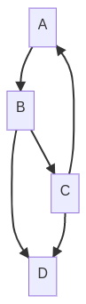

# Graphs - WIP



## Description

Graph is mathematical structure used to model pairwise relations between objects. A graph is made of vertices connected by edges.

### Types of graphs

- Directed graph

    Where edges link vertices asymmetrically.

- Undirected graph

    Where edges link vertices symmetrically.

- Simple graph
- Complete graph
- Tree

### In-memory representation

Graphs can be represented computationally by the usage of an adjacency list or a incidence matrix.

- Graphs 1 Adjacency list

    | Node | Adjacent to | vertices |
    |------|-------------|----------|
    |   A  | adjacent to |    B     |
    |   B  | adjacent to |  C,D     |
    |   C  | adjacent to |  A,D     |
    |   D  | adjacent to |   --       |

- Graph 1 incidence matrix

    |   | A | B | C | D |
    |---|---|---|---|---|
    | A | 0 | 1 | 0 | 0 |
    | B | 0 | 0 | 1 | 1 |
    | C | 1 | 0 | 0 | 1 |
    | D | 0 | 0 | 0 | 0 |

## Complexity

## Implementation

## DFS - Depth-first-search

Since Trees are also graphs, the DFS of trees and graphs are very similar, the only diferrence is that graph may contain cycles wich may lead to an infinite loop. To avoid this use a boolean array to mark the nodes that were already visited.

- Python

    ```python
    def DFS_graph (vertice, visited):
        visited.add(vertice)

        for neighbour in vertice[neighbours]:
            if neighbour not in visited:
                DFS_graph(neighbour, visited)
    ```

## BFS - Breadth-first-search

Also very similar to the BFS algorithm for trees. The only difference is the addition of the boolean array 'visited', used to avoid infinite loops and passing in the same vertice more than once.

- Python

    ```python
    def BFS_graph(vertice):
        visited = [False] * graph.size

        queue = []

        queue.append(vertice)
        visited[vertice] = True

        while len(queue) > 0:
            s = queue.pop(0)

            for i in graph[vertice].neigbours:
                if visited[i] == False:
                    queue.append(i)
                    visited[i] = True
    ```

## Dijsktra algorithm

## References

[Teoria dos Grafos](https://pt.wikipedia.org/wiki/Teoria_dos_grafos)  
[Graph data structure and algorithms](https://www.geeksforgeeks.org/graph-data-structure-and-algorithms/)  
[Deph-first-search](https://www.geeksforgeeks.org/depth-first-search-or-dfs-for-a-graph/)  
[Breadth-first-search](https://www.geeksforgeeks.org/breadth-first-search-or-bfs-for-a-graph/)  
[Incidence Matrix](http://https://en.wikipedia.org/wiki/Incidence_matrix)  
