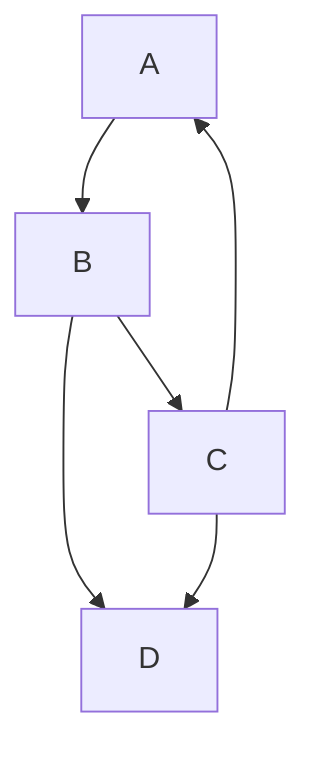

# Graphs

```mermaid
graph TD;
    A --> B;
    C --> A;
    B --> D;
    B --> C;
    C --> D;
```

## Description

## Complexity

## Implementation

## DFS - Depth-first-search

## BFS - Bread-first-search

## Dijsktra algorithm

## References
